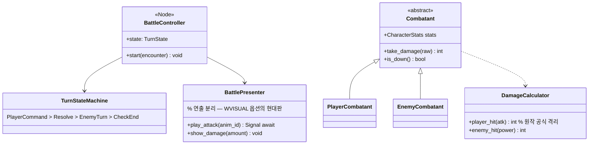
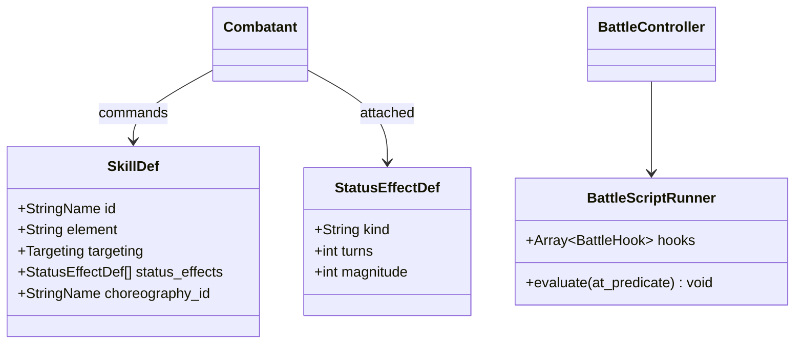

# 01. OOP 재설계 — 도메인 모델

> 원칙: **데이터(Resource)와 로직(Node) 분리**, 컴포지션 우선, 이벤트 버스 통신,
> 매직 넘버 제거(시맨틱 타입화), 외부 에디터 확장 가능한 맵 모델.

## 1. 전체 클래스 다이어그램

```mermaid
classDiagram
    %% ===== 데이터 계층 (Resource) =====
    class MapDefinition {
        +String map_id
        +Vector2i size
        +int tile_px
        +Array~MapLayerData~ layers
        +Array~SpawnPoint~ spawns
        +Array~TriggerDef~ triggers
        +EncounterTable encounters
        +get_cell(layer, coord) CellValue
        +is_passable(coord) bool
    }
    class MapLayerData {
        +String name
        +LayerKind kind  % Ground/Object/Front/Collision/Event
        +PackedInt32Array cells
    }
    class TileSpec {
        +int source_id
        +SemanticAttr attr  % Passable/Blocked/Overhead/Door...
        +bool occludes_actor
    }
    class CharacterStats {
        +int level, exp, hp, max_hp
        +int ap, dp, money
        +level_up() void
        +apply_item(item) void
    }
    class ItemDef {
        +String id
        +String display_name
        +Texture2D icon
        +ItemKind kind  % Weapon/Medicine/Quest/Money
        +StatBonus bonus
    }
    class DialogueSequence {
        +String speaker_id
        +Array~DialogueLine~ lines
        +ConditionRef condition  % GameFlags 평가식
        +Array~DialogueAction~ on_end
    }
    class EncounterTable {
        +Array~EnemyEntry~ entries
        +EnemyEntry roll(floor) EnemyDef
    }
    class EnemyDef {
        +String id, display_name
        +StatRange stats_by_floor
        +SpriteFrames battle_anim
    }

    %% ===== 런타임 계층 (Node) =====
    class Entity {
        <<CharacterBody2D>>
        #GridMover mover
        #SpriteComponent sprite
    }
    class PlayerEntity {
        +InputHandler input
        +InteractionProbe probe
    }
    class EnemyEntity {
        +AIBrain brain  % PatternAI / ChaseAI
    }
    class NpcEntity {
        +DialogueProvider dialogue
    }
    class AIBrain {
        <<abstract>>
        +tick(ctx) Direction
    }
    AIBrain <|-- PatternAI
    AIBrain <|-- ChaseAI
    Entity <|-- PlayerEntity
    Entity <|-- EnemyEntity
    Entity <|-- NpcEntity
```



## 2. C 구조체 → 클래스 매핑표

| 원본 (C) | 재설계 (GDScript) | 유형 | 비고 |
|---|---|---|---|
| `flagWE_STRUCT We` | `CharacterStats` | Resource | 세이브 대상. level_up 신규 구현 |
| `enemy_attribute eye[8]` | `EnemyEntity`(씬 인스턴스 ×N) | Node | 배열→인스턴스. 리스폰 로직은 Spawner로 |
| `eventer[5]` + EVENT.C | `NpcEntity` + `PatternAI` | Node | 배회 NPC 일반화 |
| `ITEM_STRUCT / ITEM_TABLE` 중복 | `ItemDef` 단일 DB | Resource | 24종/37종 불일치 병합 |
| `view[50]` 인벤토리 | `Inventory` | RefCounted | add/remove/count/slots 시그널 발행 |
| `item_flag[6][45]` | `GameState.chest_flags: Dictionary` | - | 키: `"floor:cell"` → 개봉 여부 |
| `TILE/OBJ/ATT far*` | `MapDefinition.layers[]` + TileMapLayer | Resource+Node | §3 참조 |
| ATT 매직 넘버(0/1/2/9/150+...) | `SemanticAttr` enum | enum | §3.2 |
| `PATTERN[10][40]` | `PatrolPath` Resource | Resource | Tiled polyline에서 생성 |
| `Talk_Window(name,num,len)` | `DialoguePlayer` + `DialogueSequence` | Node+Resource | XMS 레코드→JSON |
| `v_Hong/v_Howa/...` 플래그 | `GameFlags: Dictionary[String,Variant]` | - | 조건식으로 대사 분기 |
| `WarMode()` 자유함수군 | `BattleController` 씬 + `Combatant` | Node | 상태머신화 |
| `ME_LEVEL[20]/LEVELsruct` | `GrowthCurve` Resource | Resource | 드디어 실제 연결(레벨업 구현) |

## 3. 타일맵 — 현대적 자료구조 설계 (핵심)

### 3.1 설계 목표

| 목표 | 달성 방법 |
|---|---|
| 원본 MAP 바이트포맷과 무손실 호환 | 임포터가 BYTE[13000]×3 → `MapLayerData` 변환 |
| 논리 그리드와 렌더 해상도 분리 | 좌표는 전부 `Vector2i` 셀 단위. px는 `TileSpec.tile_px`로만 환산 |
| 레이어 확장 가능 | `LayerKind` 등록제 — Ground/Object/Front/Collision/Event + 사용자 정의 |
| 외부 에디터(Tiled) 양방향 | Tiled JSON(.tmj) ↔ `MapDefinition` 변환기 제공 (→03_data_migration.md) |
| 런타임 편집 가능 (파괴된 벽, 열린 문) | 데이터는 `Dictionary[Vector2i, CellOverride]` 오버라이드 스택 |

### 3.2 시맨틱 속성 모델 — 매직 넘버 제거

원본 ATT 바이트는 의미가 섞여 있다(통행+NPC+상자+방ID). 재설계에서는 분해한다:

```gdscript
# semantic_attr.gd
enum Attr {
    PASSABLE,        # 원본 0
    BLOCKED,         # 원본 1
    OVERHEAD,        # 원본 2 — 액터를 덮는(앞에 그리는) 통행 셀
    DOOR,            # 원본 9 — DoorTrigger로 세분화
    NPC_SPAWN,       # 원본 16..98 — npc_id 속성과 짝
    CHEST,           # 원본 150..184 — item_id 속성과 짝
    ROOM_ZONE,       # 원본 10..110 — zone_id 속성과 짝 (이벤트 트리거)
}
# 셀 = attr + 부가 데이터. TileSet Custom Data 또는 MapDefinition 내부 배열로 저장.
```

- TileSet에 Custom Data Layer: `attr(int)`, `npc_id(int)`, `item_id(int)`, `zone_id(int)`, `occludes(bool)`
- 충돌 판정은 물리 엔진 대신 **그리드 질의**(`MapDefinition.is_passable`)를 기본으로 하고,
  물리 레이어는 보조로만 사용 — 원작의 "2셀 폭 판정" 감각을 `GridMover`가 재현.

### 3.3 런타임 오버라이드 (원작의 check_item 문제 해결)

원작은 상자를 먹으면 **맵 버퍼(ATT/OBJ)를 직접 오염**시키고 층 재진입 때 복원했다.
재설계에서는 맵 원본을 불변으로 두고 변경만 기록한다:

```gdscript
# MapRuntime.gd (런타임 래퍼)
var overrides := {}   # Vector2i -> { "layer": "object", "tile": EMPTY_CHEST }

func open_chest(cell: Vector2i) -> void:
    overrides[cell] = {"layer": "object", "tile": CHEST_OPEN_ID}
    map_changed.emit(cell)
# 세이브 = overrides + chest_flags 직렬화. 맵 원본은 영구 불변.
```

### 3.4 렌더러 바인딩

`MapRenderer` 노드가 `MapDefinition`을 구독해 Godot 4.x `TileMapLayer` 노드들을
생성/동기화한다 (Ground / Object / Front(ATT==2) 최소 3레이어).

```
MapDefinition (순수 데이터, 에디터 호환)
      ▲ 읽기                    │ 변경 알림(map_changed)
MapRenderer ──► TileMapLayer×N  │
      └──► y-sort 액터들         ▼
                            MapRuntime (오버라이드/쿼리)
```

- 새 레이어 종류 추가 절차: `LayerKind` enum 값 추가 → 임포터 규칙 추가 → 끝.
  (예: 나중에 "Deco", "Shadow", "Light" 레이어를 Tiled에서 붙일 수 있음)

## 4. 대화 시스템 — 데이터 주도 재설계

원작의 하드코딩 switch(Talk() L1150-1202)를 조건 평가기로 일반화:

```gdscript
# DialogueSequence 예시 (JSON/Resource)
{
  "id": "howa_professor",
  "branches": [
    { "when": "flags.howa == 0",
      "steps": [
        {"speaker": "player",   "text": "@t192", "lines": 2},
        {"speaker": "howa",     "text": "@t0",  "lines": 4},
        {"set_flags": {"howa_jo": 1}} ]},
    { "when": "flags.howa == 2",
      "steps": [ {"speaker": "howa", "text": "@t21", "lines": 1} ]}
  ]
}
```

- `@t숫자`는 원본 TALK.TXT 인덱스 참조 — **원문 대사와 1:1 추적 가능**.
  번역/수정은 테이블만 고치면 됨.
- 퀴즈맨/상점/컷신도 동일 포맷의 특수 step 타입으로 확장 (`quiz`, `shop`, `battle`, `cutscene`).

## 5. 전투 시스템 재설계



- **로직과 연출 완전 분리**: `DamageCalculator`는 순수 함수(원작 공식 보존 or 밸런스 패치 스위치),
  `BattlePresenter`는 애니메이션·이펙트·UI. 연출 스킵/고속 전투가 공짜로 생김.
- DP(방어력) 미반영 원작 결함 → `DamageCalculator`에 반영 여부 플래그 제공.

### 5.1 스킬 시스템 (마스터 시나리오 §2.2 성장 트리 반영)

원작에는 없지만 리메이크 시나리오의 핵심 성장 축. **데이터 주도**로 정의한다:

```gdscript
# skill_def.gd (Resource)
class_name SkillDef extends Resource
@export var id: StringName            # "flame_beaker_throw"
@export var display_key: StringName   # l10n 키
@export_enum("physical","fire","electric","none") var element: String
@export var targeting: Targeting      # SINGLE / ALL_ENEMIES / SELF
@export var power: int                # DamageCalculator 배율 기준값
@export var mp_cost := 0              # 리소스 시스템 도입 전까지 0 허용
@export var status_effects: Array[StatusEffectDef]   # 부착 효과
@export var choreography_id: StringName              # battle_moves 안무 매핑
```

| 습득 스킬(6종) | element | targeting | 특수 효과 | 획득 트리거(플래그) |
|---|---|---|---|---|
| 부싯돌 치기 | physical | SINGLE | - | 시작 보유 |
| 연속 펀치 | physical | SINGLE ×3타 | 프레임 캔슬 콤보 연출 | Q_F2_FIGHTER |
| 화염 비커 투척 | fire | ALL_ENEMIES | DoT(burn, 3턴) | Q_F3_CURE_REQ |
| 디버그 쉴드 | none | SELF | 버프: 피해 50% 경감 3턴 | Q_F0_DISK |
| 10,000V 아크 방전 | electric | ALL_ENEMIES | 마비(paralysis) 1턴 | Q_F4_SACRIFICE |
| 부싯돌의 불꽃(궁극기) | none | STORY | scripted finisher 전용 | Q_ENDING |

- 습득은 이벤트 op `grant_skill`(§05_toolchain)로만 수행 — 코드 하드코딩 금지.
- 궁극기는 일반 커맨드가 아니라 **require_item_finisher**(§5.3) 전용으로 잠금 해제.

### 5.2 상태이상/버프

```gdscript
class_name StatusEffectDef extends Resource
@export_enum("dot","buff_damage_taken","paralysis") var kind: String
@export var turns: int          # 틱 지속
@export var magnitude: int      # dot=턴당 피해, buff=경감 비율(%)
```

- `TurnStateMachine`의 턴 종료 단계에서 틱 처리(dot 데미지→사망 판정 포함).
- paralysis: 해당 진영 커맨드 선택 단계 스킵.
- UI는 아이콘+잔여 턴 표시(04_uiux §1.4).

### 5.3 멀티페이즈 보스전 & 전투 스크립트 훅

SYS_BUILDER전(마스터 §5)은 "전투↔대사↔아이템 피니시"가 교차하는 컷신형 보스전이다.
전투도 이벤트 op 체계 위에 놓는다:

```jsonc
// data/events/sys_builder_battle.json
{ "op": "start_battle", "args": {
    "enemy": "sys_builder",
    "script": [
      { "at": "hp_below:30%",        "do": "phase_transition", "to": "awakened" },
      { "at": "phase:awakened:start","do": "mid_battle_dialogue", "seq": "@c516" },
      { "at": "item_used:diskette",  "do": "unlock_command", "skill": "ember_of_flint" },
      { "at": "skill_used:ember_of_flint", "do": "require_item_finisher",
        "cinematic": "cutscene:ending_finisher" }
    ]}}
```

- 트리거 조건(`at`)은 소수의 선언적 술어만 지원(hp_below / phase / item_used / turn_at / skill_used)
  — 범용 스크립팅 언어화 방지(AI 친화 규칙 유지).
- `BattleScriptRunner`가 이를 구독 실행하며, 대사 중 입력은 CutscenePlayer에 위임 후 복귀.



## 6. 게임플로우/상태 관리

```
SceneRouter (autoload)
  ├─ TitleScene
  ├─ FieldScene ──── MapRenderer / Entities / HUD / DialogueBox
  ├─ BattleScene ─── BattleController / Presenter
  └─ CutscenePlayer ─ event1 등 타임라인 재생

GameState (autoload): floor, stats, inventory, flags, chest_overrides
EventBus (autoload): encounter_started / item_obtained / dialogue_finished ...
```

- 원작 main() while루프의 if문 나열(ENTER→메뉴, SPACE→대화…)은
  각각 **독립 컴포넌트의 입력 핸들러 + EventBus**로 분해.
